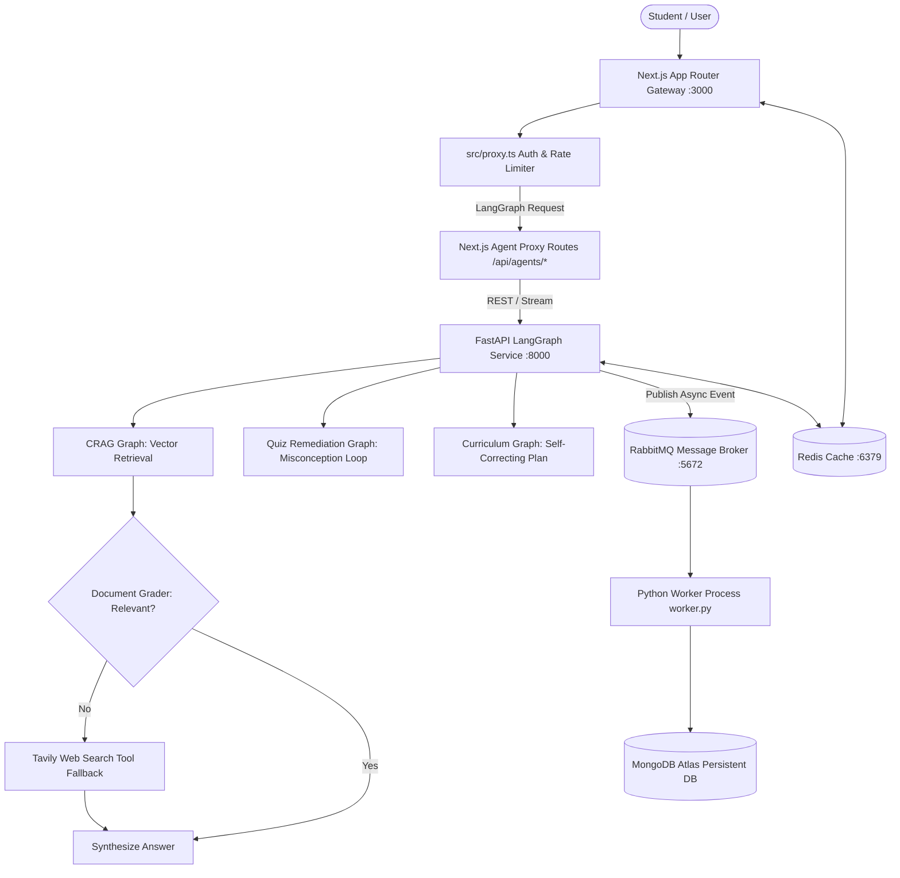

# 🎓 Eklavya AI — Intelligent Learning Platform with LangGraph & Microservices

[](https://nextjs.org/)
[](https://fastapi.tiangolo.com/)
[](https://python.langchain.com/docs/langgraph)
[](https://www.mongodb.com/)
[](https://qdrant.tech/)
[](https://upstash.com/)
[](https://www.rabbitmq.com/)
[](https://www.docker.com/)

> **Eklavya AI** is a production-grade, microservice-powered learning platform. It combines a Next.js frontend gateway with a dedicated **FastAPI LangGraph Microservice** providing Corrective RAG (CRAG) with web search tools, adaptive quiz misconception loops, interactive result remediation, Redis multi-tier caching, RabbitMQ asynchronous database ingestion, and full containerization via Docker Compose.

---

## 🌟 Key Features

- **🤖 LangGraph Agent Microservice (`/ai-agent-service`)**: Independent FastAPI service running multi-node state graphs for complex agentic workflows.
- **🔍 Corrective RAG (CRAG)**: Evaluates vector search context relevance; automatically falls back to **Tavily Web Search Tool** when course notes are missing or insufficient.
- **🔄 Adaptive Quiz Misconception Loop & ResultView**: Evaluates wrong student answers, identifies specific conceptual misconceptions, generates a 3-bullet micro-lesson, and constructs a live retry question directly inside the attempt view.
- **🗺️ Autonomous Curriculum Roadmap Agent**: Generates 4-week personalized study plans with self-correction loops to avoid student workload overload.
- **🚀 RabbitMQ Write-Behind Ingestion Pipeline**: Asynchronously offloads DB persistence (quiz attempt logging, analytics processing) from the main API path to RabbitMQ queues consumed by a background Python worker (`worker.py`).
- **⚡ Multi-Tier Redis Caching**: Sub-5ms caching for CRAG queries, user context, and dashboard analytics.
- **🐳 Full Docker Containerization**: Complete multi-container `docker-compose.yml` orchestrating Next.js, FastAPI, Worker, Redis, and RabbitMQ.

---

## 🏗️ System Architecture



---

## 🛠️ Tech Stack & Microservices

| Service / Container | Tech Stack | Role & Purpose |
|---|---|---|
| **Web Frontend** | Next.js 14, React, Tailwind CSS | UI components, streaming chat, NextAuth, and API gateway |
| **AI Microservice** | FastAPI, LangGraph, LangChain, Pydantic | Stateful multi-node AI graphs (CRAG, Quiz Remediation, Curriculum Agent) |
| **Ingestion Worker** | Python 3.11, `aio-pika`, `motor` | Consumes RabbitMQ queues and writes DB records asynchronously |
| **Message Broker** | RabbitMQ 3.8 | Asynchronous queueing for quiz attempt logging & analytics |
| **Cache Tier** | Redis 7 | Sub-5ms response caching for CRAG, chat history, and dashboard context |
| **Vector DB** | Qdrant Cloud | Cosine similarity vector search with course-level metadata filters |
| **Primary Database** | MongoDB Atlas | Persistence for user profiles, courses, quiz attempts, and user progress |

---

## ⚡ Docker Quick Start

### 1. Configure Environment Variables
Copy `.env.example` to `.env.local` in the root directory, and copy `./ai-agent-service/.env.example` to `./ai-agent-service/.env`.

### 2. Run Containerized Stack
```bash
docker-compose up --build
```

The stack will spin up:
- **Next.js Web UI**: `http://localhost:3000`
- **FastAPI LangGraph Docs**: `http://localhost:8000/docs`
- **RabbitMQ Management Dashboard**: `http://localhost:15672` (Login: `guest` / `guest`)
- **Redis Cache**: `localhost:6379`

---

## 🔗 LangGraph Agent API Endpoints

| Endpoint | Method | Input Payload | Output / Feature |
|---|---|---|---|
| `/api/v1/crag` | `POST` | `{ "question": "...", "courseId": "..." }` | Corrective RAG with Tavily web search fallback |
| `/api/v1/quiz/remediate` | `POST` | `{ "topic": "...", "questionText": "...", "userAnswer": "...", "correctAnswer": "..." }` | Misconception diagnosis, micro-lesson, and retry question |
| `/api/v1/roadmap/generate` | `POST` | `{ "studentGoal": "...", "weakTopics": [...], "availableHoursPerWeek": 10 }` | Self-correcting 4-week study roadmap |
| `/api/v1/queue/quiz-attempt` | `POST` | `{ "userId": "...", "courseId": "...", "score": 80, ... }` | Asynchronously pushes quiz payload to RabbitMQ queue |

---

## 🚀 100% Free Production Deployment

You can deploy the complete Eklavya AI stack for **$0/month**:

1. **Next.js Gateway**: Deploy on [Vercel](https://vercel.com) (Hobby Free Plan).
2. **FastAPI Agent Service + Embedded Ingestion Worker**: Deploy as a single free Web Service on [Render](https://render.com) or [Koyeb](https://koyeb.com). (The RabbitMQ worker runs as an embedded `asyncio` task inside FastAPI startup lifespan).
3. **MongoDB**: Use [MongoDB Atlas M0 Free Tier](https://www.mongodb.com/cloud/atlas).
4. **Vector DB**: Use [Qdrant Cloud Free Tier](https://cloud.qdrant.io) (1GB Free).
5. **Cache**: Use [Upstash Redis](https://upstash.com) (Serverless Free Tier).
6. **Message Broker**: Use [CloudAMQP](https://www.cloudamqp.com) (Little Lemur Free RabbitMQ).

---

## 📖 Deep Architecture & Study Guide

For an in-depth technical dive into every page's capabilities, Generative AI algorithms, trade-offs, and microservice mechanics, read:
👉 [**SYSTEM_ARCHITECTURE_AND_AI_LESSONS.md**](./SYSTEM_ARCHITECTURE_AND_AI_LESSONS.md)

