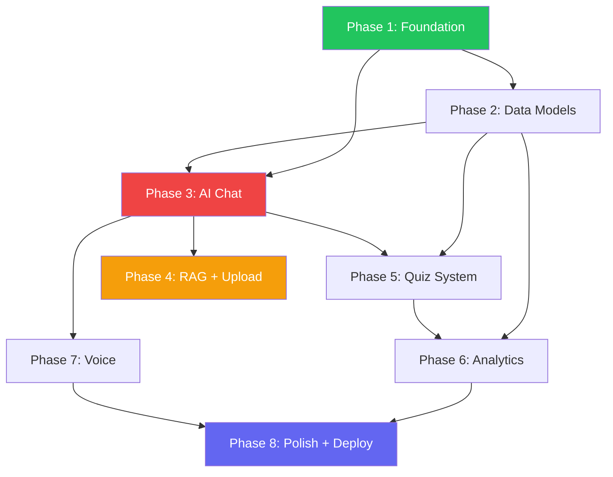

# EKLAVYA — AI Learning Platform: Implementation Plan

## Current State Audit

### ✅ What's Already Built
| Layer | Component | Status |
|---|---|---|
| Auth | NextAuth (credentials) + sign-in/sign-up pages | ✅ Working |
| DB | MongoDB Atlas connection + User model (Mongoose) | ✅ Working |
| API | `/api/auth/*`, `/api/user` (CRUD), `/api/auth/register` | ✅ Working |
| UI Shell | Sidebar, Navbar, AuthenticatedLayout, Providers | ✅ Working |
| Chat | `ChatUI.tsx` with markdown/code rendering | ⚠️ Simulated (no real AI) |
| Dashboard | Basic shell with placeholder course cards | ⚠️ Skeleton only |
| Profile | Profile page exists | ✅ Working |
| Middleware | NextAuth route protection on `/dashboard/*` | ✅ Working |

### ❌ What's Missing (from the Architecture Diagram)
- **LangGraph Orchestrator** — no orchestration engine
- **AI Services** — no RAG, Quiz, Voice, Analytics, or Recommendation services
- **Model Router** — no multi-model selection / fallback logic
- **Data Layer** — no Vector DB (Qdrant), no Redis cache, no Analytics DB collections
- **Dashboard Analytics** — no progress graphs, topic mastery, weak topics, retention
- **File Upload** — no PDF/notes upload pipeline
- **Voice** — no STT (Whisper) or TTS integration
- **Course/Subject system** — no models, no CRUD

---

## Target File Structure

```
src/
├── app/
│   ├── (auth)/                    # Auth group (sign-in, sign-up)
│   ├── (dashboard)/               # Protected dashboard group
│   │   ├── layout.tsx             # AuthenticatedLayout wrapper
│   │   ├── page.tsx               # Dashboard home / overview
│   │   ├── chat/page.tsx          # AI Chat interface
│   │   ├── courses/
│   │   │   ├── page.tsx           # Course listing
│   │   │   └── [courseId]/page.tsx # Single course view
│   │   ├── quiz/
│   │   │   ├── page.tsx           # Quiz listing
│   │   │   └── [quizId]/page.tsx  # Take quiz
│   │   ├── upload/page.tsx        # File upload
│   │   ├── analytics/page.tsx     # Student analytics dashboard
│   │   ├── profile/page.tsx       # Profile settings
│   │   └── settings/page.tsx      # App settings
│   └── api/
│       ├── auth/[...nextauth]/route.ts
│       ├── auth/register/route.ts
│       ├── user/route.ts
│       ├── chat/route.ts              # Chat + orchestrator endpoint
│       ├── chat/history/route.ts      # Chat history CRUD
│       ├── courses/route.ts           # Course CRUD
│       ├── courses/[courseId]/route.ts
│       ├── quiz/generate/route.ts     # AI quiz generation
│       ├── quiz/submit/route.ts       # Quiz submission + grading
│       ├── quiz/history/route.ts
│       ├── upload/route.ts            # File upload + processing
│       ├── voice/stt/route.ts         # Speech-to-text
│       ├── voice/tts/route.ts         # Text-to-speech
│       ├── analytics/route.ts         # Analytics data
│       └── recommendations/route.ts   # AI recommendations
├── components/
│   ├── layout/         # Sidebar, Navbar, AuthenticatedLayout
│   ├── chat/           # ChatUI, MessageBubble, CodeBlock
│   ├── dashboard/      # StatCard, ProgressChart, WeakTopics
│   ├── quiz/           # QuizCard, QuestionView, ResultView
│   ├── course/         # CourseCard, SubjectPicker
│   ├── upload/         # FileDropzone, ProcessingStatus
│   └── ui/             # Button, Input, Modal, Skeleton, etc.
├── lib/
│   ├── mongodb.ts
│   ├── ai/
│   │   ├── orchestrator.ts    # LangGraph-like intent router
│   │   ├── model-router.ts    # Multi-model selection + fallback
│   │   ├── rag.ts             # RAG pipeline (embed + retrieve)
│   │   ├── quiz-generator.ts  # Quiz generation from notes
│   │   └── prompts.ts         # System prompts & templates
│   ├── vector/
│   │   └── qdrant.ts          # Qdrant client
│   └── redis.ts               # Redis/Upstash client (cache + rate limit)
├── models/
│   ├── User.ts
│   ├── Course.ts
│   ├── Subject.ts
│   ├── ChatHistory.ts
│   ├── QuizAttempt.ts
│   ├── UserProgress.ts
│   ├── UploadedFile.ts
│   └── Analytics.ts
├── hooks/
│   ├── useChat.ts
│   ├── useQuiz.ts
│   ├── useAnalytics.ts
│   └── useCourses.ts
└── utils/
    ├── asyncHandler.ts
    ├── embeddings.ts
    └── constants.ts
```

---

## Implementation Phases

---

### Phase 1 — Foundation Cleanup & Design System
**Duration:** 1–2 days · **Risk:** Low

> [!IMPORTANT]
> This phase restructures the project skeleton and establishes visual identity. Everything else builds on this.

#### Tasks

| # | Task | Files |
|---|---|---|
| 1.1 | Restructure routes using Next.js route groups: `(auth)` for sign-in/sign-up, `(dashboard)` for all protected pages | `src/app/(auth)/`, `src/app/(dashboard)/` |
| 1.2 | Move `AuthenticatedLayout` into `(dashboard)/layout.tsx` so every dashboard page auto-wraps | `src/app/(dashboard)/layout.tsx` |
| 1.3 | Build reusable UI primitives: Button, Input, Card, Modal, Skeleton, Badge, Avatar | `src/components/ui/*` |
| 1.4 | Overhaul `globals.css` — dark-first design tokens, glassmorphism utilities, animation keyframes | `src/app/globals.css` |
| 1.5 | Update metadata in root `layout.tsx` (title: "Eklavya AI", description, fonts) | `src/app/layout.tsx` |
| 1.6 | Clean up unused Clerk env vars from `.env.local` | `.env.local` |

---

### Phase 2 — Data Models & Course System
**Duration:** 2–3 days · **Risk:** Low

#### New Mongoose Models

```
Course       → { title, description, subjects[], createdBy, thumbnail, isPublic }
Subject      → { name, courseId(ref), description, order }
ChatHistory  → { userId(ref), courseId(ref), messages[], createdAt }
QuizAttempt  → { userId, courseId, subjectId, questions[], score, timeTaken }
UserProgress → { userId, courseId, subjectId, topicsMastered[], accuracy, streakDays }
UploadedFile → { userId, courseId, originalName, storagePath, fileType, status, embeddings[] }
Analytics    → { userId, dailyActivity[], weeklyAccuracy[], retentionScores[] }
```

#### Tasks

| # | Task | Files |
|---|---|---|
| 2.1 | Create all Mongoose models listed above | `src/models/*` |
| 2.2 | Build Course CRUD API (`GET/POST /api/courses`, `GET/PUT/DELETE /api/courses/[courseId]`) | `src/api/courses/` |
| 2.3 | Build Courses listing page with cards, search, filters | `src/app/(dashboard)/courses/page.tsx` |
| 2.4 | Build single course detail page (subjects list, progress bar, chat entry point) | `src/app/(dashboard)/courses/[courseId]/page.tsx` |
| 2.5 | Create `useCourses` hook for client-side data fetching | `src/hooks/useCourses.ts` |
| 2.6 | Seed 3–5 starter courses (DSA, Web Dev, ML, etc.) via a seed script | `scripts/seed.ts` |

---

### Phase 3 — AI Chat Core (The Heart)
**Duration:** 3–4 days · **Risk:** Medium-High

> [!WARNING]
> This is the most critical phase. The orchestrator, model router, and chat API form the backbone of the entire platform.

#### 3A — Model Router & AI Client

| # | Task | Files |
|---|---|---|
| 3A.1 | Install AI SDKs: `openai`, `@google/generative-ai`, `@anthropic-ai/sdk` | `package.json` |
| 3A.2 | Build `model-router.ts` — selects best model based on task type (coding → GPT-4, math → Gemini, general → Claude). Includes fallback chain logic | `src/lib/ai/model-router.ts` |
| 3A.3 | Build unified `callModel()` wrapper that normalizes responses across providers | `src/lib/ai/model-router.ts` |
| 3A.4 | Add env vars: `OPENAI_API_KEY`, `GOOGLE_AI_KEY`, `ANTHROPIC_API_KEY` | `.env.local` |

#### 3B — Orchestrator (Intent → Action)

| # | Task | Files |
|---|---|---|
| 3B.1 | Build `orchestrator.ts` — detects intent (chat, doubt, quiz, recommendation, voice), builds context from user history, routes to appropriate service | `src/lib/ai/orchestrator.ts` |
| 3B.2 | Create prompt templates: system prompt, context-injection template, quiz-gen template | `src/lib/ai/prompts.ts` |

#### 3C — Chat API & UI Upgrade

| # | Task | Files |
|---|---|---|
| 3C.1 | Build `/api/chat/route.ts` — streaming endpoint (uses orchestrator → model router → response) | `src/app/api/chat/route.ts` |
| 3C.2 | Build `/api/chat/history/route.ts` — save/load chat threads per course | `src/app/api/chat/history/route.ts` |
| 3C.3 | Upgrade `ChatUI.tsx` to use real streaming, conversation threads, course-context | `src/components/chat/ChatUI.tsx` |
| 3C.4 | Build `useChat` hook with streaming support | `src/hooks/useChat.ts` |
| 3C.5 | Create dedicated chat page at `(dashboard)/chat/page.tsx` | `src/app/(dashboard)/chat/page.tsx` |

---

### Phase 4 — RAG Pipeline & File Upload
**Duration:** 3–4 days · **Risk:** Medium

#### 4A — Vector Database Setup

| # | Task | Files |
|---|---|---|
| 4A.1 | Set up Qdrant Cloud (free tier) or local Docker instance | Infrastructure |
| 4A.2 | Build Qdrant client wrapper (`createCollection`, `upsert`, `search`) | `src/lib/vector/qdrant.ts` |
| 4A.3 | Build embedding utility (using OpenAI `text-embedding-3-small`) | `src/utils/embeddings.ts` |

#### 4B — File Upload Pipeline

| # | Task | Files |
|---|---|---|
| 4B.1 | Build `/api/upload/route.ts` — accepts PDF, DOCX, TXT. Parses → chunks → embeds → stores in Qdrant | `src/app/api/upload/route.ts` |
| 4B.2 | Install `pdf-parse`, `mammoth` for document parsing | `package.json` |
| 4B.3 | Build Upload page UI with drag-and-drop zone, file list, processing status | `src/app/(dashboard)/upload/page.tsx` |
| 4B.4 | Build `FileDropzone` and `ProcessingStatus` components | `src/components/upload/*` |

#### 4C — RAG Service Integration

| # | Task | Files |
|---|---|---|
| 4C.1 | Build `rag.ts` — Query → Retrieve from Qdrant → Build prompt with context → Call model | `src/lib/ai/rag.ts` |
| 4C.2 | Integrate RAG into the orchestrator (when intent=doubt and user has uploaded materials) | `src/lib/ai/orchestrator.ts` |

---

### Phase 5 — Quiz System
**Duration:** 2–3 days · **Risk:** Medium

| # | Task | Files |
|---|---|---|
| 5.1 | Build `quiz-generator.ts` — takes topic/notes → LLM generates MCQs with explanations | `src/lib/ai/quiz-generator.ts` |
| 5.2 | Build `/api/quiz/generate/route.ts` — generates quiz for a course/subject | `src/app/api/quiz/generate/route.ts` |
| 5.3 | Build `/api/quiz/submit/route.ts` — grades answers, saves `QuizAttempt`, updates `UserProgress` | `src/app/api/quiz/submit/route.ts` |
| 5.4 | Build Quiz listing page (past attempts, generate new) | `src/app/(dashboard)/quiz/page.tsx` |
| 5.5 | Build Quiz-taking UI (question navigation, timer, submit) | `src/app/(dashboard)/quiz/[quizId]/page.tsx` |
| 5.6 | Build results view with correct/incorrect breakdown + explanations | `src/components/quiz/ResultView.tsx` |

---

### Phase 6 — Analytics Dashboard
**Duration:** 2–3 days · **Risk:** Low

| # | Task | Files |
|---|---|---|
| 6.1 | Build `/api/analytics/route.ts` — aggregates progress, quiz scores, streaks, weak topics | `src/app/api/analytics/route.ts` |
| 6.2 | Redesign main Dashboard (`(dashboard)/page.tsx`) with: overview stats, progress graph, recent activity, quick actions | `src/app/(dashboard)/page.tsx` |
| 6.3 | Build `StatCard` component (animated counter, icon, trend indicator) | `src/components/dashboard/StatCard.tsx` |
| 6.4 | Build progress chart (use lightweight chart lib like `recharts` or canvas-based) | `src/components/dashboard/ProgressChart.tsx` |
| 6.5 | Build weak topics panel (topic → mastery % → suggested action) | `src/components/dashboard/WeakTopics.tsx` |
| 6.6 | Build recommendations section using `/api/recommendations/route.ts` | `src/app/api/recommendations/route.ts` |
| 6.7 | Build retention analysis view (what you learned, what you forgot, retention %) | `src/components/dashboard/RetentionView.tsx` |
| 6.8 | Dedicated analytics page with full breakdowns | `src/app/(dashboard)/analytics/page.tsx` |

---

### Phase 7 — Voice (Optional / Stretch)
**Duration:** 2–3 days · **Risk:** High

> [!NOTE]
> Voice is a differentiator but not critical for MVP. Can be deferred to v2.

| # | Task | Files |
|---|---|---|
| 7.1 | Build STT endpoint using Whisper API (OpenAI) or browser `SpeechRecognition` | `src/app/api/voice/stt/route.ts` |
| 7.2 | Build TTS endpoint using browser `SpeechSynthesis` or a TTS API | `src/app/api/voice/tts/route.ts` |
| 7.3 | Add mic button to ChatUI — record → transcribe → send as text | `src/components/chat/VoiceInput.tsx` |
| 7.4 | Add "read aloud" button on AI responses | `src/components/chat/ReadAloud.tsx` |

---

### Phase 8 — Polish, Caching & Deployment
**Duration:** 2–3 days · **Risk:** Low

| # | Task | Files |
|---|---|---|
| 8.1 | Add Redis/Upstash for session caching, rate limiting, background job queuing | `src/lib/redis.ts` |
| 8.2 | Implement rate limiting middleware for AI endpoints | `src/middleware.ts` |
| 8.3 | Landing page redesign (hero, features grid, CTA, testimonials) | `src/app/page.tsx` |
| 8.4 | Loading states: skeleton screens for dashboard, chat, courses | All pages |
| 8.5 | Error boundaries and toast notifications | `src/components/ui/` |
| 8.6 | SEO: meta tags, OG images, sitemap | `src/app/layout.tsx` |
| 8.7 | Deploy: Frontend → Vercel, set env vars | Vercel config |
| 8.8 | Write comprehensive README with setup instructions | `README.md` |

---

## Dependency Graph



---

## Environment Variables Needed

```env
# --- Existing ---
MONGODB_URI=
NEXTAUTH_SECRET=
NEXTAUTH_URL=

# --- Phase 3: AI Models ---
OPENAI_API_KEY=
GOOGLE_AI_API_KEY=
ANTHROPIC_API_KEY=

# --- Phase 4: Vector DB ---
QDRANT_URL=
QDRANT_API_KEY=

# --- Phase 8: Cache ---
UPSTASH_REDIS_URL=
UPSTASH_REDIS_TOKEN=
```

---

## Key Dependencies to Add

| Phase | Package | Purpose |
|---|---|---|
| 3 | `openai` | GPT-4 / embeddings |
| 3 | `@google/generative-ai` | Gemini models |
| 3 | `@anthropic-ai/sdk` | Claude models |
| 4 | `@qdrant/js-client-rest` | Vector search |
| 4 | `pdf-parse` | PDF text extraction |
| 4 | `mammoth` | DOCX text extraction |
| 6 | `recharts` | Analytics charts |
| 8 | `@upstash/redis` | Caching + rate limiting |
| 8 | `@upstash/ratelimit` | API rate limiting |

---

## Estimated Timeline

| Phase | Duration | Cumulative |
|---|---|---|
| Phase 1 — Foundation | 1–2 days | Day 2 |
| Phase 2 — Data Models | 2–3 days | Day 5 |
| Phase 3 — AI Chat | 3–4 days | Day 9 |
| Phase 4 — RAG + Upload | 3–4 days | Day 13 |
| Phase 5 — Quiz System | 2–3 days | Day 16 |
| Phase 6 — Analytics | 2–3 days | Day 19 |
| Phase 7 — Voice (stretch) | 2–3 days | Day 22 |
| Phase 8 — Polish + Deploy | 2–3 days | **Day 25** |

> [!TIP]
> **MVP Target (Phases 1–6):** ~19 days for a fully functional AI tutor with chat, RAG, quizzes, and analytics. Voice (Phase 7) is a stretch goal.
